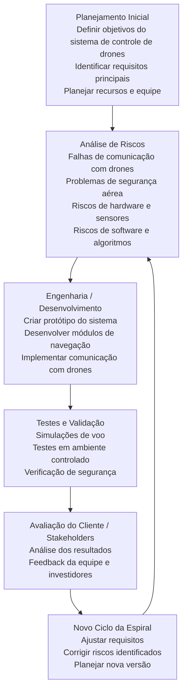

# Semana 3 - 🚨 Missão Crítica: Operação Resgate

## 1. Solução usando modelo espiral de Boehm
O Modelo Espiral, proposto por Barry Boehm, combina a abordagem sistemática do modelo em cascata com a natureza iterativa do desenvolvimento evolutivo. Ele é o mais indicado para gerenciar projetos de grande porte e alta complexidade.

### Porque usar o modelo espiral
O desenvolvimento progride de forma espiral, composto por múltiplos laços, onde cada laço representa um ciclo de desenvolvimento completo. 
A análise de riscos é o diferencial deste modelo, sendo fundamental para evitar falhas críticas. As principais atividades nesta fase incluem:
* **Identificação de Riscos:** Avaliação de fatores relacionados a custos, cronograma, desempenho e tecnologia.
* **Seleção de Soluções:** Determinação da melhor alternativa técnica ou gerencial.
* **Prototipagem:** Criação de protótipos para validar requisitos e reduzir incertezas.

## Modelo espiral recomendado:

---

## 2. Diagnóstico CMMI – Chaos-IT
Com base nos processos atuais, a empresa encontra-se no **Nível 1** do CMMI.

* **Ambiente Caótico:** A organização carece de processos formais, tornando o sucesso dos projetos imprevisível.
* **Dependência de Esforço Heróico:** Há uma dependência excessiva de desenvolvedores específicos que realizam horas extras, gerando sobrecarga.
* **Falta de Padronização:** Ausência de métodos de trabalho compartilhados; cada colaborador atua de maneira isolada e sem diretrizes comuns.
* **Gestão Empírica:** A gestão é baseada em "suposições", com total ausência de métricas de estimativa ou planejamentos fundamentados em dados.
*
* Por que a Análise de Riscos em cada volta da espiral teria evitado a queda dos drones?

No Modelo Espiral, cada ciclo do desenvolvimento inclui uma etapa obrigatória de análise e mitigação de riscos antes de continuar o projeto.

No caso da Chaos-IT, o sistema de controle de drones falhou porque os riscos técnicos não foram avaliados antecipadamente.
Por que a Análise de Riscos em cada volta da espiral teria evitado a queda dos drones?

No Modelo Espiral, cada ciclo do desenvolvimento inclui uma etapa obrigatória de análise e mitigação de riscos antes de continuar o projeto.

No caso da Chaos-IT, o sistema de controle de drones falhou porque os riscos técnicos não foram avaliados antecipadamente.

Se a empresa tivesse aplicado o Modelo Espiral, em cada volta da espiral a equipe teria identificado e testado riscos como:

falhas no algoritmo de navegação

perda de comunicação entre drone e servidor

erro nos sensores de altitude ou GPS

problemas de bateria em rotas longas

falhas no sistema de detecção de obstáculos

Durante a fase de análise de riscos, a equipe poderia:

criar protótipos do sistema

realizar simulações de voo

testar sensores em ambiente controlado

validar o sistema antes da implementação real

Dessa forma, problemas críticos seriam descobertos antes da implantação em produção, evitando a queda dos drones e os prejuízos financeiros.al a equipe teria identificado e testado riscos como:

falhas no algoritmo de navegação

perda de comunicação entre drone e servidor

erro nos sensores de altitude ou GPS

problemas de bateria em rotas longas

falhas no sistema de detecção de obstáculos

Durante a fase de análise de riscos, a equipe poderia:

criar protótipos do sistema

realizar simulações de voo

testar sensores em ambiente controlado

validar o sistema antes da implementação real

Dessa forma, problemas críticos seriam descobertos antes da implantação em produção, evitando a queda dos drones e os prejuízos financeiros.
